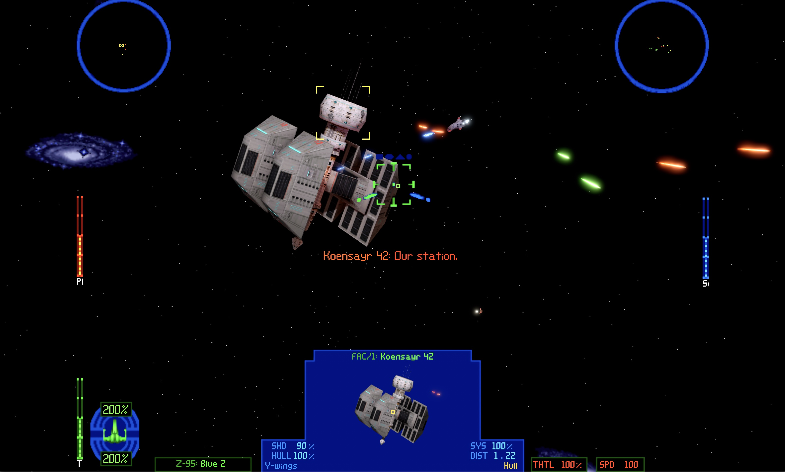

# OpenXvT

[](https://github.com/elyosh/OpenXvT/releases/latest)
[](https://discord.gg/WBvYzczWfG)



OpenXvT is an open-source reimplementation of the 1997 game *Star Wars:
X-Wing vs. TIE Fighter* with its *Balance of Power* expansion for Windows,
macOS, and Linux. It runs the original game data natively on current systems
while preserving the original experience and offering optional modern
enhancements.

> [!IMPORTANT]
> OpenXvT does not include any content from the original game. A complete
> installation of *X-Wing vs. TIE Fighter* with *Balance of Power* is required.
>
> The game, including the expansion, is available from
> [GOG](https://www.gog.com/en/game/star_wars_xwing_vs_tie_fighter) and
> [Steam](https://store.steampowered.com/app/361690/Star_Wars_X_Wing_Vs_Tie_Fighter_Balance_Of_Power_Campaigns/).

## Graphics

OpenXvT offers classic and modern graphics modes. Classic mode preserves the
original game's appearance, while modern mode combines the original models
and cockpit artwork with high-resolution rendering and advanced lighting.

Modern graphics include:

- shadows, ambient occlusion, bloom, and motion blur
- anisotropic texture filtering
- 2x, 4x, or 8x MSAA
- AMD FidelityFX FSR 3.1.4 temporal anti-aliasing and upscaling
- HDR output
- optional smoothing of dithered cockpit artwork

Press `TAB` while the game is running to switch between classic and modern
graphics.

## Smoother flight and modern controls

Flight runs at a higher simulation rate for smoother motion and more
responsive input on modern displays.

OpenXvT adds virtual-stick mouse flight control, with adjustable sensitivity
and Y-axis inversion. Flight can be played with a mouse and keyboard, so a
joystick or gamepad is no longer required. Modern gamepads and joysticks are
also supported, with configurable axes, deadzones, and button bindings.

## Getting started

1. Download the latest package for your platform from
   [GitHub Releases](https://github.com/elyosh/bop/releases/latest).
2. Extract or install the package and launch OpenXvT.
3. Select the main *X-Wing vs. TIE Fighter* installation folder containing
   `BalanceOfPower` when prompted.
4. To fly with a mouse, open **OpenXvT Settings**, select the **Mouse** tab,
   and enable **Mouse Flight Control**.

Press `ESC` to open **OpenXvT Settings**.

Useful shortcuts:

| Key | Action |
|---|---|
| `ESC` | Open OpenXvT Settings |
| `TAB` | Switch between classic and modern graphics |
| `Shift`+`TAB` | Start flight chat |
| `Ctrl`+`Alt`+`M` | Release or recapture the mouse during flight |

For unattended or development launches, pass the game-data folder on the
command line:

```sh
OpenXvT --game-data /path/to/xvt-data
```

## Supported platforms

| Platform | Target | Graphics backend |
|---|---|---|
| Windows | x86-64 | Direct3D 12 or Vulkan |
| macOS | macOS 13 or later; arm64 or x86-64 | Metal |
| Linux | x86-64; glibc 2.35 or later | Vulkan |

## Current state

OpenXvT remains under active development. Bugs and differences from the
original game are still possible.

## OpenTIE and OpenXWA

Fans of Totally Games' space simulators may also be interested in
[OpenTIE](https://github.com/elyosh/OpenTIE), an open-source reimplementation
of *Star Wars: TIE Fighter*, and [OpenXWA](https://github.com/elyosh/OpenXWA),
an open-source reimplementation of *Star Wars: X-Wing Alliance*. Both run on
Windows, macOS, and Linux.

## Community

Join the [TotallyOpen Discord server](https://discord.gg/WBvYzczWfG) to discuss
OpenXvT, OpenTIE, OpenXWA, development, and the Totally Games flight simulators.

## System requirements

- a 64-bit system with a modern GPU
- a complete installation of *X-Wing vs. TIE Fighter* with *Balance of Power*
- a mouse and keyboard, gamepad, or joystick for flight

Release packages include the required runtime libraries. Keep the executable,
libraries, resources, and shader directories together when moving an
installation. Linux also requires the system libcurl library.

## Building from source

The build requires CMake 3.20 or later, a C/C++ toolchain, SDL3 3.4, zstd,
FFmpeg, libcurl, pkg-config, and SDL_shadercross. Release packaging pins its
dependencies and provides the reference for reproducible builds.

Platform-specific instructions for Windows, macOS, and Linux are available in
the [packaging guide](packaging/README.md).
